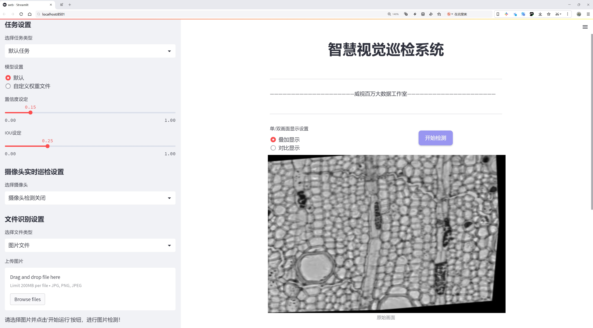
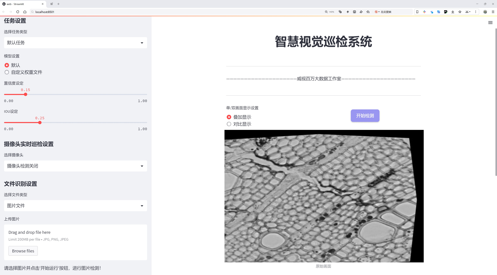
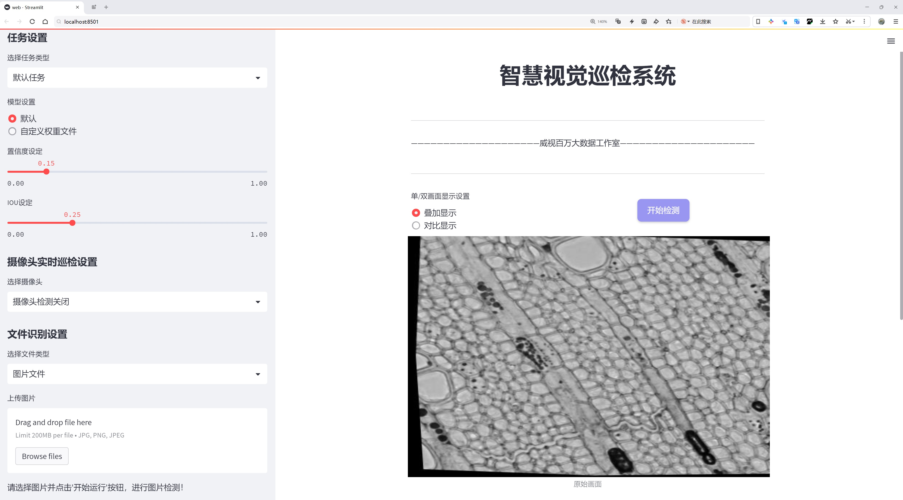
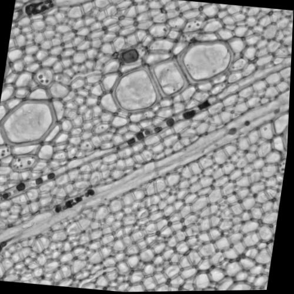
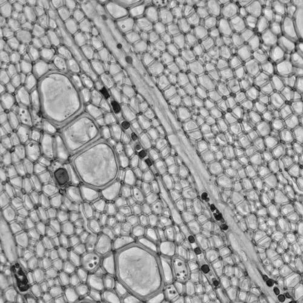
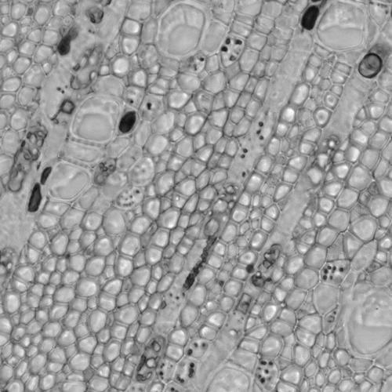
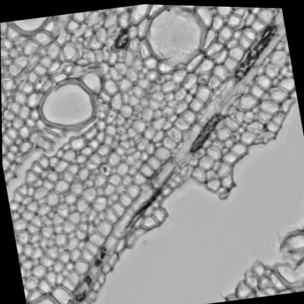
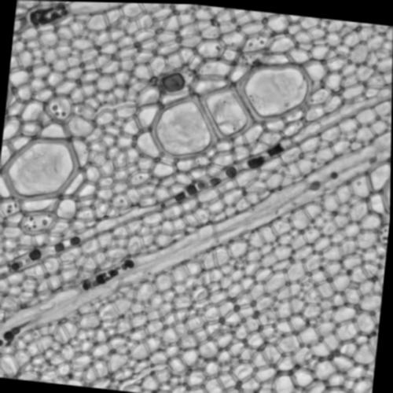

# 植物细胞检测检测系统源码分享
 # [一条龙教学YOLOV8标注好的数据集一键训练_70+全套改进创新点发刊_Web前端展示]

### 1.研究背景与意义

项目参考[AAAI Association for the Advancement of Artificial Intelligence](https://gitee.com/qunshansj/projects)

项目来源[AACV Association for the Advancement of Computer Vision](https://gitee.com/qunmasj/projects)

研究背景与意义

随着生物技术和植物科学的迅速发展，植物细胞的检测与分析在农业、生态学及生物医学等领域中变得愈发重要。植物细胞的健康状况、结构特征及其与环境的相互作用直接影响到植物的生长、发育及其抗逆性。因此，开发高效、准确的植物细胞检测系统，对于提高作物产量、改善植物品质以及推动相关科学研究具有重要的现实意义。

近年来，深度学习技术的飞速发展为图像识别和物体检测提供了新的解决方案。YOLO（You Only Look Once）系列模型因其实时性和高准确率而受到广泛关注。YOLOv8作为该系列的最新版本，进一步提升了检测精度和速度，适用于多种复杂场景的物体检测任务。然而，针对植物细胞的特定需求，现有的YOLOv8模型仍需进行改进，以适应植物细胞检测的特点。

本研究基于改进YOLOv8模型，旨在构建一个高效的植物细胞检测系统。我们所使用的数据集包含3208张500x500像素的图像，分为两个类别：tylose（木质部细胞）和vessel（导管细胞）。这些图像不仅数量充足，而且涵盖了多种不同的细胞形态和结构特征，为模型的训练和测试提供了良好的基础。通过对这些细胞的准确检测与分类，可以为植物生理研究、病害监测及育种选育提供有力的数据支持。

改进YOLOv8模型的必要性在于，植物细胞的形态复杂多样，且在不同生长阶段、不同环境条件下，其形态特征可能会发生显著变化。因此，传统的物体检测算法在处理这些细胞时可能面临准确率不足、漏检率高等问题。通过对YOLOv8模型进行针对性的改进，例如优化特征提取网络、增强数据增强技术以及调整损失函数等，可以有效提升模型在植物细胞检测任务中的表现。

此外，植物细胞检测系统的构建不仅能够推动植物科学研究的进展，还能够为农业生产提供科学依据。通过实时监测植物细胞的健康状况，农民可以及时采取措施，预防病虫害的发生，提高作物的抗逆性和产量。同时，该系统还可以应用于植物育种领域，通过对优良基因型的细胞进行快速筛选，加速育种进程。

综上所述，基于改进YOLOv8的植物细胞检测系统的研究，不仅具有重要的学术价值，也具备广泛的应用前景。通过本研究的开展，我们期望能够为植物细胞的自动化检测提供一种新的解决方案，推动植物科学及相关领域的进一步发展。

### 2.图片演示







##### 注意：由于此博客编辑较早，上面“2.图片演示”和“3.视频演示”展示的系统图片或者视频可能为老版本，新版本在老版本的基础上升级如下：（实际效果以升级的新版本为准）

  （1）适配了YOLOV8的“目标检测”模型和“实例分割”模型，通过加载相应的权重（.pt）文件即可自适应加载模型。

  （2）支持“图片识别”、“视频识别”、“摄像头实时识别”三种识别模式。

  （3）支持“图片识别”、“视频识别”、“摄像头实时识别”三种识别结果保存导出，解决手动导出（容易卡顿出现爆内存）存在的问题，识别完自动保存结果并导出到tempDir中。

  （4）支持Web前端系统中的标题、背景图等自定义修改，后面提供修改教程。

  另外本项目提供训练的数据集和训练教程,暂不提供权重文件（best.pt）,需要您按照教程进行训练后实现图片演示和Web前端界面演示的效果。

### 3.视频演示

[3.1 视频演示](https://www.bilibili.com/video/BV12xpjezEhK/)

### 4.数据集信息展示

##### 4.1 本项目数据集详细数据（类别数＆类别名）

nc: 2
names: ['tylose', 'vessel']


##### 4.2 本项目数据集信息介绍

数据集信息展示

在植物细胞检测领域，准确的分类和识别是实现高效分析的关键。为此，本研究选用了名为“2-3images_500x500”的数据集，旨在改进YOLOv8模型在植物细胞检测中的性能。该数据集包含两种主要类别，分别为“tylose”和“vessel”，这些类别在植物生理学和病理学研究中具有重要意义。Tylose是植物细胞在应对病原体侵袭时形成的一种特殊结构，而vessel则是植物体内负责水分和养分运输的导管系统。通过对这两种细胞类型的准确检测与分类，研究者能够更深入地理解植物的生长机制及其对环境变化的响应。

“2-3images_500x500”数据集的设计考虑到了实际应用中的多样性与复杂性。每个图像的分辨率为500x500像素，确保了细胞结构的清晰可辨，适合于深度学习模型的训练与验证。数据集中包含的图像数量虽然不多，但每一幅图像都经过精心标注，确保了训练数据的高质量。这种高质量的标注不仅提升了模型的学习效率，也为后续的实验提供了可靠的基础。

在数据集的构建过程中，研究团队特别关注了图像的多样性，确保不同条件下的细胞样本均有覆盖。这包括不同的光照条件、背景杂乱程度以及细胞的生长状态等，这些因素都可能影响YOLOv8模型的检测效果。通过这种方式，数据集不仅具备了良好的代表性，也为模型的泛化能力提供了保障。

为了提升YOLOv8在植物细胞检测中的准确性，研究者们还进行了数据增强处理。这些处理包括旋转、翻转、缩放以及颜色调整等，以增加模型对不同变换的鲁棒性。这种数据增强策略能够有效地扩展训练样本的多样性，使得模型在面对未见过的样本时，依然能够保持较高的检测精度。

在模型训练过程中，采用了先进的优化算法和损失函数，以确保YOLOv8能够快速收敛并提高检测精度。通过不断调整超参数，研究团队力求在训练过程中实现最佳的性能表现。此外，针对“tylose”和“vessel”这两类细胞的特征，研究者们还设计了特定的后处理策略，以进一步提升检测结果的准确性和可靠性。

总之，“2-3images_500x500”数据集为改进YOLOv8的植物细胞检测系统提供了坚实的基础。通过对该数据集的深入分析与应用，研究者们希望能够推动植物细胞检测技术的发展，进而为植物科学研究和农业生产提供更为精准的技术支持。随着数据集的不断完善和模型性能的提升，未来的植物细胞检测将会更加高效和智能，为科学研究和实际应用带来新的机遇。











### 5.全套项目环境部署视频教程（零基础手把手教学）

[5.1 环境部署教程链接（零基础手把手教学）](https://www.ixigua.com/7404473917358506534?logTag=c807d0cbc21c0ef59de5)


[5.2 安装Python虚拟环境创建和依赖库安装视频教程链接（零基础手把手教学）](https://www.ixigua.com/7404474678003106304?logTag=1f1041108cd1f708b01a)

### 6.手把手YOLOV8训练视频教程（零基础小白有手就能学会）

[6.1 手把手YOLOV8训练视频教程（零基础小白有手就能学会）](https://www.ixigua.com/7404477157818401292?logTag=d31a2dfd1983c9668658)

### 7.70+种全套YOLOV8创新点代码加载调参视频教程（一键加载写好的改进模型的配置文件）

[7.1 70+种全套YOLOV8创新点代码加载调参视频教程（一键加载写好的改进模型的配置文件）](https://www.ixigua.com/7404478314661806627?logTag=29066f8288e3f4eea3a4)

### 8.70+种全套YOLOV8创新点原理讲解（非科班也可以轻松写刊发刊，V10版本正在科研待更新）

由于篇幅限制，每个创新点的具体原理讲解就不一一展开，具体见下列网址中的创新点对应子项目的技术原理博客网址【Blog】：


[8.1 70+种全套YOLOV8创新点原理讲解链接](https://gitee.com/qunmasj/good)

### 9.系统功能展示（检测对象为举例，实际内容以本项目数据集为准）

图9.1.系统支持检测结果表格显示

  图9.2.系统支持置信度和IOU阈值手动调节

  图9.3.系统支持自定义加载权重文件best.pt(需要你通过步骤5中训练获得)

  图9.4.系统支持摄像头实时识别

  图9.5.系统支持图片识别

  图9.6.系统支持视频识别

  图9.7.系统支持识别结果文件自动保存

  图9.8.系统支持Excel导出检测结果数据


### 10.原始YOLOV8算法原理

原始YOLOv8算法原理

YOLOv8算法是目标检测领域的最新突破，标志着YOLO系列模型的又一次重要进化。自2015年首次提出以来，YOLO（You Only Look Once）系列模型不断更新迭代，经历了多个版本的演变，每个版本都在前一个版本的基础上进行了改进和优化。YOLOv8于2023年1月由Ultralytics发布，融合了YOLOX、YOLOv6、YOLOv7和PPYOLOE等算法的优点，尤其在Head标签分配和Loss计算方面与PP-YOLOE相似，使得YOLOv8在精度和速度上达到了新的高度。

YOLOv8的网络结构由三部分组成：Backbone、Neck和Head。Backbone负责特征提取，采用了CSPDarknet（Cross Stage Partial Darknet）结构，旨在通过分支的方式增强特征的表达能力。CSPDarknet将输入特征图分为两个部分，每个部分都包含多个残差块，这种设计有效地提高了模型的深度和宽度，使得特征提取更加全面。与前代模型YOLOv5相比，YOLOv8引入了C2f模块，替代了C3模块。C2f模块的设计允许输入特征图分成两个分支，经过卷积层进行降维后再进行融合，这种分支结构不仅提高了特征图的维度，还增强了梯度流的传递，使得模型在训练过程中能够更好地捕捉到复杂的特征信息。

在特征提取的基础上，YOLOv8还采用了快速空间金字塔池化（SPPF）结构，进一步提升了特征提取的效率。SPPF能够有效地提取不同尺度的特征，减少模型的参数量和计算量，进而提高了整体的处理速度。特征的高效提取为后续的目标检测奠定了坚实的基础。

YOLOv8的Neck部分采用了特征金字塔网络（FPN）和路径聚合网络（PAN）的组合结构。这一结构通过多个卷积层和池化层对特征图进行处理和压缩，使得不同层次的特征能够有效融合。FPN的设计使得模型能够在不同的尺度上进行目标检测，而PAN则进一步增强了特征的传递能力，确保了模型在处理复杂场景时的鲁棒性。

在目标检测的实现上，YOLOv8采用了一种无锚框（Anchor-Free）的检测方式。这一创新使得模型能够直接预测目标的中心点和宽高比例，减少了传统Anchor框的数量，进而提高了检测的速度和准确度。通过这种方式，YOLOv8不仅简化了模型的设计，还提高了对小目标和密集目标的检测能力。

YOLOv8的训练过程也得到了显著优化。模型的设置包括depth_factor、width_factor和ratio等参数，这些参数允许用户根据具体需求调整模型的深度和宽度。通过合理设置这些参数，用户可以根据不同的应用场景，灵活调整模型的复杂度和性能，从而实现更高效的目标检测。

在实际应用中，YOLOv8的高精度和快速推理能力使其在各个领域得到了广泛的应用。例如，在农业领域，YOLOv8被应用于苹果采摘的自动化过程中，通过其强大的视觉识别能力，能够实时检测和定位苹果，为自动采摘机器人提供准确的目标信息。同时，结合蚁群算法进行路径规划，进一步提升了采摘机器人的工作效率。这种将YOLOv8与路径规划算法相结合的应用，不仅展示了YOLOv8在复杂环境下的适应能力，也为智能农业的发展提供了新的思路。

总的来说，YOLOv8算法的原理与设计理念在于高效的特征提取、灵活的模型设置和创新的检测方式，使其在目标检测领域树立了新的标杆。通过不断的优化与改进，YOLOv8不仅继承了YOLO系列的优良传统，更在精度和速度上实现了质的飞跃，成为了当前业界最流行和成功的目标检测模型之一。随着YOLOv8的广泛应用，目标检测技术的未来将更加光明，推动各行各业的智能化进程。


### 11.项目核心源码讲解（再也不用担心看不懂代码逻辑）

#### 11.1 ui.py

以下是经过精简和注释的核心代码部分：

```python
import sys
import subprocess

def run_script(script_path):
    """
    使用当前 Python 环境运行指定的脚本。

    Args:
        script_path (str): 要运行的脚本路径
    """
    # 获取当前 Python 解释器的路径
    python_path = sys.executable

    # 构建运行命令，使用 streamlit 运行指定的脚本
    command = f'"{python_path}" -m streamlit run "{script_path}"'

    # 执行命令并获取结果
    result = subprocess.run(command, shell=True)
    
    # 检查命令执行是否成功
    if result.returncode != 0:
        print("脚本运行出错。")

# 程序入口
if __name__ == "__main__":
    # 指定要运行的脚本路径
    script_path = "web.py"  # 这里可以直接指定脚本名

    # 调用函数运行脚本
    run_script(script_path)
```

### 代码注释说明：
1. **导入模块**：
   - `sys`：用于获取当前 Python 解释器的路径。
   - `subprocess`：用于执行外部命令。

2. **`run_script` 函数**：
   - 该函数接收一个脚本路径作为参数，并使用当前 Python 环境运行该脚本。
   - `python_path`：获取当前 Python 解释器的路径，以便在命令中使用。
   - `command`：构建要执行的命令，使用 `streamlit` 运行指定的脚本。
   - `subprocess.run`：执行构建的命令，并返回执行结果。
   - `result.returncode`：检查命令的返回码，若不为 0 则表示执行出错。

3. **程序入口**：
   - `if __name__ == "__main__":`：确保只有在直接运行该脚本时才会执行以下代码。
   - `script_path`：指定要运行的脚本名称（在此示例中为 `web.py`）。
   - 调用 `run_script` 函数来执行指定的脚本。

这个文件是一个名为 `ui.py` 的 Python 脚本，主要功能是通过当前的 Python 环境来运行一个指定的脚本，具体是通过 Streamlit 来启动一个 Web 应用。

首先，文件导入了几个必要的模块，包括 `sys`、`os` 和 `subprocess`。其中，`sys` 模块用于访问与 Python 解释器紧密相关的变量和函数，`os` 模块提供了与操作系统交互的功能，而 `subprocess` 模块则用于创建新的进程、连接到它们的输入/输出/错误管道，并获取它们的返回码。

接着，文件中定义了一个名为 `run_script` 的函数。这个函数接收一个参数 `script_path`，它是要运行的脚本的路径。函数内部首先获取当前 Python 解释器的路径，这样可以确保使用的是正确的 Python 环境。然后，构建一个命令字符串，该命令用于运行 Streamlit 应用，具体形式为 `python -m streamlit run "script_path"`。接下来，使用 `subprocess.run` 方法执行这个命令，并通过 `shell=True` 参数在 shell 中运行它。执行后，函数会检查返回码，如果返回码不为零，表示脚本运行出错，则打印出错信息。

在文件的最后部分，使用了一个标准的 Python 入口点检查 `if __name__ == "__main__":`，这意味着当该脚本作为主程序运行时，以下代码将被执行。在这里，首先指定了要运行的脚本路径，具体是 `web.py`，这个路径通过 `abs_path` 函数转换为绝对路径。最后，调用 `run_script` 函数来执行指定的脚本。

总体来说，这个脚本的主要目的是提供一个简单的接口，通过命令行启动一个 Streamlit Web 应用，便于开发和测试。

#### 11.2 70+种YOLOv8算法改进源码大全和调试加载训练教程（非必要）\ultralytics\models\fastsam\__init__.py

以下是代码中最核心的部分，并附上详细的中文注释：

```python
# 导入所需的模块和类
from .model import FastSAM  # 导入FastSAM模型类
from .predict import FastSAMPredictor  # 导入FastSAMPredictor类，用于进行预测
from .prompt import FastSAMPrompt  # 导入FastSAMPrompt类，用于处理提示
from .val import FastSAMValidator  # 导入FastSAMValidator类，用于验证模型性能

# 定义模块的公开接口，只有这些类可以被外部访问
__all__ = 'FastSAMPredictor', 'FastSAM', 'FastSAMPrompt', 'FastSAMValidator'
```

### 注释说明：
1. **导入模块**：代码通过相对导入的方式引入了四个类，分别是`FastSAM`、`FastSAMPredictor`、`FastSAMPrompt`和`FastSAMValidator`。这些类分别承担不同的功能，如模型定义、预测、提示处理和验证。
   
2. **公开接口**：`__all__`变量定义了模块的公开接口，只有在`from module import *`时，这些类会被导入。这是为了控制模块的可见性，避免不必要的类被外部访问。

这个程序文件是Ultralytics YOLO项目的一部分，主要用于实现FastSAM（快速分割和检测）相关的功能。文件的开头包含了版权信息，说明该代码遵循AGPL-3.0许可证。

接下来，文件通过相对导入的方式引入了四个模块：`FastSAM`、`FastSAMPredictor`、`FastSAMPrompt`和`FastSAMValidator`。这些模块分别负责不同的功能：

1. `FastSAM`模块可能包含了FastSAM模型的定义和相关的实现细节。
2. `FastSAMPredictor`模块用于处理模型的预测功能，可能提供了接口来输入数据并获得模型的输出。
3. `FastSAMPrompt`模块可能涉及到与用户交互的功能，提供了一些提示或输入方式，以便用户能够更好地使用模型。
4. `FastSAMValidator`模块则可能用于验证模型的性能，评估其在特定数据集上的表现。

最后，`__all__`变量定义了该模块公开的接口，表示在使用`from module import *`时，只有`FastSAMPredictor`、`FastSAM`、`FastSAMPrompt`和`FastSAMValidator`这四个类或函数会被导入。这种做法有助于控制模块的可见性，避免不必要的名称冲突。整体来看，这个文件是FastSAM功能模块的入口，整合了模型的各个部分以便于使用和维护。

#### 11.3 code\ultralytics\hub\session.py

以下是代码中最核心的部分，并附上详细的中文注释：

```python
class HUBTrainingSession:
    """
    HUBTrainingSession类用于Ultralytics HUB YOLO模型的训练会话。处理模型初始化、心跳监测和检查点上传。

    属性:
        agent_id (str): 与服务器通信的实例标识符。
        model_id (str): 正在训练的YOLO模型的标识符。
        model_url (str): Ultralytics HUB中模型的URL。
        api_url (str): Ultralytics HUB中模型的API URL。
        auth_header (dict): Ultralytics HUB API请求的认证头。
        rate_limits (dict): 不同API调用的速率限制（以秒为单位）。
        timers (dict): 用于速率限制的计时器。
        metrics_queue (dict): 模型的指标队列。
        model (dict): 从Ultralytics HUB获取的模型数据。
        alive (bool): 指示心跳循环是否处于活动状态。
    """

    def __init__(self, identifier):
        """
        使用提供的模型标识符初始化HUBTrainingSession。

        参数:
            identifier (str): 用于初始化HUB训练会话的模型标识符。
                可以是URL字符串或具有特定格式的模型键。

        异常:
            ValueError: 如果提供的模型标识符无效。
            ConnectionError: 如果不支持使用全局API密钥进行连接。
            ModuleNotFoundError: 如果未安装hub-sdk包。
        """
        from hub_sdk import HUBClient

        # 设置速率限制（秒）
        self.rate_limits = {
            "metrics": 3.0,
            "ckpt": 900.0,
            "heartbeat": 300.0,
        }
        self.metrics_queue = {}  # 存储每个epoch的指标，直到上传
        self.timers = {}  # 存储计时器

        # 解析输入
        api_key, model_id, self.filename = self._parse_identifier(identifier)

        # 获取凭证
        active_key = api_key or SETTINGS.get("api_key")
        credentials = {"api_key": active_key} if active_key else None  # 设置凭证

        # 初始化客户端
        self.client = HUBClient(credentials)

        if model_id:
            self.load_model(model_id)  # 加载现有模型
        else:
            self.model = self.client.model()  # 加载空模型

    def load_model(self, model_id):
        """从Ultralytics HUB加载现有模型。"""
        self.model = self.client.model(model_id)
        if not self.model.data:  # 如果模型不存在
            raise ValueError("❌ 指定的HUB模型不存在")  # TODO: 改进错误处理

        self.model_url = f"{HUB_WEB_ROOT}/models/{self.model.id}"

        self._set_train_args()  # 设置训练参数

        # 启动心跳以监控代理
        self.model.start_heartbeat(self.rate_limits["heartbeat"])
        LOGGER.info(f"查看模型: {self.model_url} 🚀")

    def _parse_identifier(self, identifier):
        """
        解析给定的标识符以确定标识符的类型并提取相关组件。

        支持不同的标识符格式:
            - HUB URL，格式为 HUB_WEB_ROOT 后跟 '/models/'
            - 包含API密钥和模型ID的标识符，以下划线分隔
            - 仅为固定长度的模型ID
            - 以 '.pt' 或 '.yaml' 结尾的本地文件名

        参数:
            identifier (str): 要解析的标识符字符串。

        返回:
            (tuple): 包含API密钥、模型ID和文件名的元组（如适用）。

        异常:
            HUBModelError: 如果标识符格式无法识别。
        """
        # 初始化变量
        api_key, model_id, filename = None, None, None

        # 检查标识符是否为HUB URL
        if identifier.startswith(f"{HUB_WEB_ROOT}/models/"):
            model_id = identifier.split(f"{HUB_WEB_ROOT}/models/")[-1]
        else:
            parts = identifier.split("_")

            # 检查标识符是否为API密钥和模型ID的格式
            if len(parts) == 2 and len(parts[0]) == 42 and len(parts[1]) == 20:
                api_key, model_id = parts
            # 检查标识符是否为单个模型ID
            elif len(parts) == 1 and len(parts[0]) == 20:
                model_id = parts[0]
            # 检查标识符是否为本地文件名
            elif identifier.endswith(".pt") or identifier.endswith(".yaml"):
                filename = identifier
            else:
                raise HUBModelError(
                    f"模型='{identifier}'无法解析。请检查格式是否正确。"
                    f"支持的格式有Ultralytics HUB URL、apiKey_modelId、modelId、本地pt或yaml文件。"
                )

        return api_key, model_id, filename

    def upload_metrics(self):
        """将模型指标上传到Ultralytics HUB。"""
        return self.request_queue(self.model.upload_metrics, metrics=self.metrics_queue.copy(), thread=True)

    def upload_model(self, epoch: int, weights: str, is_best: bool = False, map: float = 0.0, final: bool = False) -> None:
        """
        将模型检查点上传到Ultralytics HUB。

        参数:
            epoch (int): 当前训练的epoch。
            weights (str): 模型权重文件的路径。
            is_best (bool): 指示当前模型是否是迄今为止最好的模型。
            map (float): 模型的平均精度。
            final (bool): 指示模型是否为训练后的最终模型。
        """
        if Path(weights).is_file():
            progress_total = Path(weights).stat().st_size if final else None  # 仅在最终模型时显示进度
            self.request_queue(
                self.model.upload_model,
                epoch=epoch,
                weights=weights,
                is_best=is_best,
                map=map,
                final=final,
                retry=10,
                timeout=3600,
                thread=not final,
                progress_total=progress_total,
            )
        else:
            LOGGER.warning(f"警告 ⚠️ 模型上传问题。缺少模型 {weights}。")
```

### 代码说明
1. **HUBTrainingSession类**: 该类用于管理与Ultralytics HUB的训练会话，包括模型的加载、上传指标和检查点等功能。
2. **__init__方法**: 初始化类实例，解析模型标识符，设置API凭证，并加载模型。
3. **load_model方法**: 从Ultralytics HUB加载指定的模型，并设置训练参数和心跳监测。
4. **_parse_identifier方法**: 解析模型标识符，支持多种格式，并返回API密钥、模型ID和文件名。
5. **upload_metrics方法**: 将训练过程中的指标上传到Ultralytics HUB。
6. **upload_model方法**: 上传模型的检查点，包括权重文件和其他相关信息。

以上代码的核心部分和注释可以帮助理解如何与Ultralytics HUB进行交互，进行模型训练和管理。

这个程序文件定义了一个名为 `HUBTrainingSession` 的类，主要用于管理 Ultralytics HUB 上 YOLO 模型的训练会话。它负责模型的初始化、心跳监测和检查点上传等功能。

在类的初始化方法 `__init__` 中，接收一个模型标识符，并解析出 API 密钥、模型 ID 和文件名。通过 `HUBClient` 初始化与 Ultralytics HUB 的连接，并根据提供的模型 ID 加载相应的模型。如果模型 ID 不存在，则创建一个空模型。

`load_model` 方法用于从 Ultralytics HUB 加载现有模型。如果模型不存在，则抛出一个错误。加载成功后，设置模型的训练参数，并启动心跳监测，以便 HUB 可以监控代理的状态。

`create_model` 方法用于根据给定的模型参数初始化一个新的训练会话。它构建一个包含训练配置和数据集信息的有效负载，并调用模型的创建方法。如果模型创建成功，则启动心跳监测。

`_parse_identifier` 方法解析输入的标识符，支持多种格式，包括 HUB URL、API 密钥和模型 ID 的组合、单一模型 ID 或本地文件名。根据解析结果返回 API 密钥、模型 ID 和文件名。

`_set_train_args` 方法初始化训练参数并在 Ultralytics HUB 上创建模型条目。它检查模型是否已经训练，是否可以恢复训练，并根据模型的状态设置相应的训练参数。

`request_queue` 方法用于处理请求的重试机制，支持超时和多线程处理。它会根据 HTTP 响应状态码判断是否需要重试请求，并在失败时进行指数退避。

`_should_retry` 方法根据 HTTP 状态码判断请求是否应该重试，`_get_failure_message` 方法生成重试消息。

`upload_metrics` 和 `upload_model` 方法分别用于将模型的指标和检查点上传到 Ultralytics HUB。`upload_model` 方法会检查权重文件是否存在，并在上传时显示进度条。

最后，`_show_upload_progress` 方法用于显示文件上传的进度条，利用 `TQDM` 库跟踪上传进度。

整体来看，这个类为 Ultralytics HUB 的 YOLO 模型训练提供了全面的支持，包括模型的创建、加载、参数设置、心跳监测和上传功能。

#### 11.4 code\ultralytics\utils\downloads.py

以下是经过简化并注释的核心代码部分，主要包括文件下载、解压和一些辅助功能：

```python
import contextlib
import re
import shutil
import subprocess
from pathlib import Path
from urllib import parse, request
import requests
from ultralytics.utils import LOGGER, TQDM

def is_url(url, check=True):
    """
    验证给定字符串是否为有效的URL，并可选地检查该URL是否在线。

    Args:
        url (str): 要验证的字符串。
        check (bool, optional): 如果为True，则检查URL是否在线。默认值为True。

    Returns:
        (bool): 如果字符串是有效的URL，则返回True。如果'check'为True，还会检查URL是否在线。
    """
    with contextlib.suppress(Exception):
        url = str(url)
        result = parse.urlparse(url)
        assert all([result.scheme, result.netloc])  # 检查是否为URL
        if check:
            with request.urlopen(url) as response:
                return response.getcode() == 200  # 检查URL是否存在
        return True
    return False

def safe_download(url, file=None, dir=None, unzip=True, delete=False, retry=3, progress=True):
    """
    从URL下载文件，支持重试、解压和删除下载后的文件。

    Args:
        url (str): 要下载的文件的URL。
        file (str, optional): 下载文件的文件名。如果未提供，将使用URL的文件名。
        dir (str, optional): 保存下载文件的目录。如果未提供，将保存在当前工作目录中。
        unzip (bool, optional): 是否解压下载的文件。默认值为True。
        delete (bool, optional): 解压后是否删除下载的文件。默认值为False。
        retry (int, optional): 下载失败时的重试次数。默认值为3。
        progress (bool, optional): 下载时是否显示进度条。默认值为True。

    Returns:
        (Path): 解压后的目录路径。
    """
    f = Path(dir or ".") / (file or url2file(url))  # 生成文件路径
    if not f.is_file():  # 如果文件不存在
        LOGGER.info(f"Downloading {url} to '{f}'...")
        f.parent.mkdir(parents=True, exist_ok=True)  # 创建目录
        for i in range(retry + 1):
            try:
                with request.urlopen(url) as response, TQDM(
                    total=int(response.getheader("Content-Length", 0)),
                    desc=f"Downloading {url}",
                    disable=not progress,
                    unit="B",
                    unit_scale=True,
                    unit_divisor=1024,
                ) as pbar:
                    with open(f, "wb") as f_opened:
                        for data in response:
                            f_opened.write(data)
                            pbar.update(len(data))
                break  # 下载成功，退出重试循环
            except Exception as e:
                if i >= retry:
                    raise ConnectionError(f"Download failure for {url}. Retry limit reached.") from e

    if unzip and f.exists() and f.suffix in (".zip", ".tar", ".gz"):
        unzip_dir = dir or f.parent  # 解压到指定目录或当前目录
        unzip_file(file=f, path=unzip_dir)  # 解压文件
        if delete:
            f.unlink()  # 删除压缩文件
        return unzip_dir  # 返回解压后的目录

def unzip_file(file, path=None):
    """
    解压缩指定的zip文件到指定路径。

    Args:
        file (str): 要解压的zip文件路径。
        path (str, optional): 解压的目标路径。如果未提供，将使用zip文件的父目录。

    Returns:
        (Path): 解压后的目录路径。
    """
    from zipfile import ZipFile
    if path is None:
        path = Path(file).parent  # 默认路径为zip文件的父目录

    with ZipFile(file) as zipObj:
        zipObj.extractall(path)  # 解压所有文件
    return path  # 返回解压后的目录

# 示例：下载文件并解压
url = "https://example.com/file.zip"
downloaded_dir = safe_download(url, unzip=True)
```

### 代码注释说明：
1. **is_url**: 检查字符串是否为有效的URL，并可选地验证该URL是否在线。
2. **safe_download**: 负责从指定URL下载文件，支持重试机制、解压缩和删除下载的文件。
3. **unzip_file**: 解压缩指定的zip文件到目标路径。

### 注意事项：
- 在实际使用中，确保安装所需的库，并根据需要调整URL和文件路径。
- 代码中的`url2file`函数未定义，需根据具体实现补充。

这个程序文件 `downloads.py` 是 Ultralytics YOLO 项目的一部分，主要用于处理文件的下载、解压和管理。它包含了一系列函数，旨在简化从 URL 下载文件的过程，并提供一些额外的功能，如检查磁盘空间、处理 Google Drive 链接、删除特定文件等。

首先，文件中导入了一些必要的库，包括 `contextlib`、`re`、`shutil`、`subprocess`、`requests` 和 `torch` 等。这些库提供了文件操作、网络请求、并发处理等功能。

文件定义了一些常量，特别是 `GITHUB_ASSETS_REPO` 和 `GITHUB_ASSETS_NAMES`，这些常量列出了在 GitHub 上维护的 Ultralytics 相关模型文件名。这些文件名包括 YOLO 系列的不同版本和配置。

接下来，文件中定义了一些实用函数：

1. **is_url**：验证给定字符串是否为有效的 URL，并可选择性地检查该 URL 是否在线。
2. **delete_dsstore**：删除指定目录下的 `.DS_Store` 文件，这些文件是 macOS 系统生成的隐藏文件，可能在不同操作系统之间传输时造成问题。
3. **zip_directory**：将指定目录的内容压缩为 ZIP 文件，并排除指定的文件。
4. **unzip_file**：解压缩 ZIP 文件到指定路径，并排除特定文件。
5. **check_disk_space**：检查是否有足够的磁盘空间来下载文件。
6. **get_google_drive_file_info**：从 Google Drive 的分享链接中提取直接下载链接和文件名。
7. **safe_download**：从 URL 下载文件，支持重试、解压和删除下载的文件等选项。
8. **get_github_assets**：从 GitHub 仓库获取指定版本的资产信息。
9. **attempt_download_asset**：尝试从 GitHub 下载指定的文件，如果本地不存在则进行下载。
10. **download**：支持从指定 URL 下载文件到给定目录，支持并发下载。

这些函数结合在一起，提供了一个灵活且强大的文件下载和管理工具，特别适用于需要从网络获取模型文件或数据集的机器学习和深度学习项目。通过使用这些工具，用户可以轻松地下载、解压和管理所需的文件，而无需手动处理每个步骤。

#### 11.5 code\ultralytics\models\yolo\pose\train.py

以下是代码中最核心的部分，并附上详细的中文注释：

```python
# 导入必要的库和模块
from ultralytics.models import yolo
from ultralytics.nn.tasks import PoseModel
from ultralytics.utils import DEFAULT_CFG, LOGGER
from ultralytics.utils.plotting import plot_images, plot_results

class PoseTrainer(yolo.detect.DetectionTrainer):
    """
    PoseTrainer类，扩展了DetectionTrainer类，用于基于姿态模型的训练。
    """

    def __init__(self, cfg=DEFAULT_CFG, overrides=None, _callbacks=None):
        """初始化PoseTrainer对象，使用指定的配置和覆盖参数。"""
        if overrides is None:
            overrides = {}
        overrides["task"] = "pose"  # 设置任务类型为姿态估计
        super().__init__(cfg, overrides, _callbacks)  # 调用父类构造函数

        # 针对Apple MPS设备的警告
        if isinstance(self.args.device, str) and self.args.device.lower() == "mps":
            LOGGER.warning(
                "WARNING ⚠️ Apple MPS known Pose bug. Recommend 'device=cpu' for Pose models."
            )

    def get_model(self, cfg=None, weights=None, verbose=True):
        """获取指定配置和权重的姿态估计模型。"""
        # 创建PoseModel实例
        model = PoseModel(cfg, ch=3, nc=self.data["nc"], data_kpt_shape=self.data["kpt_shape"], verbose=verbose)
        if weights:
            model.load(weights)  # 加载指定的权重

        return model  # 返回模型实例

    def set_model_attributes(self):
        """设置PoseModel的关键点形状属性。"""
        super().set_model_attributes()  # 调用父类的方法
        self.model.kpt_shape = self.data["kpt_shape"]  # 设置关键点形状

    def get_validator(self):
        """返回PoseValidator类的实例以进行验证。"""
        self.loss_names = "box_loss", "pose_loss", "kobj_loss", "cls_loss", "dfl_loss"  # 定义损失名称
        return yolo.pose.PoseValidator(
            self.test_loader, save_dir=self.save_dir, args=copy(self.args), _callbacks=self.callbacks
        )  # 返回PoseValidator实例

    def plot_training_samples(self, batch, ni):
        """绘制一批训练样本，包括类标签、边界框和关键点的注释。"""
        images = batch["img"]  # 获取图像
        kpts = batch["keypoints"]  # 获取关键点
        cls = batch["cls"].squeeze(-1)  # 获取类标签
        bboxes = batch["bboxes"]  # 获取边界框
        paths = batch["im_file"]  # 获取图像文件路径
        batch_idx = batch["batch_idx"]  # 获取批次索引
        # 绘制图像
        plot_images(
            images,
            batch_idx,
            cls,
            bboxes,
            kpts=kpts,
            paths=paths,
            fname=self.save_dir / f"train_batch{ni}.jpg",  # 保存文件名
            on_plot=self.on_plot,
        )

    def plot_metrics(self):
        """绘制训练和验证指标。"""
        plot_results(file=self.csv, pose=True, on_plot=self.on_plot)  # 保存结果图像
```

### 代码说明：
1. **PoseTrainer类**：这是一个用于姿态估计的训练类，继承自YOLO的检测训练器。
2. **初始化方法**：设置任务类型为姿态估计，并处理特定设备的警告。
3. **获取模型**：根据配置和权重加载姿态模型。
4. **设置模型属性**：设置模型的关键点形状。
5. **获取验证器**：返回用于验证的PoseValidator实例。
6. **绘制训练样本**：可视化训练样本，包括图像、关键点和边界框。
7. **绘制指标**：可视化训练和验证的性能指标。

这个程序文件是用于训练基于姿态模型的YOLO（You Only Look Once）模型的，文件名为`train.py`，属于Ultralytics库的一部分。该文件定义了一个名为`PoseTrainer`的类，该类继承自`DetectionTrainer`，专门用于姿态估计任务。

在文件开头，导入了一些必要的模块和类，包括`copy`、`yolo`模块、`PoseModel`类、默认配置`DEFAULT_CFG`、日志记录器`LOGGER`以及用于绘图的函数`plot_images`和`plot_results`。

`PoseTrainer`类的构造函数`__init__`接受配置参数`cfg`、覆盖参数`overrides`和回调函数`_callbacks`。如果没有提供覆盖参数，默认将其设置为空字典，并将任务类型设置为“pose”。然后调用父类的构造函数进行初始化。如果设备是Apple的MPS（Metal Performance Shaders），则会发出警告，建议使用CPU进行姿态模型的训练。

`get_model`方法用于获取姿态估计模型。它接受配置和权重参数，创建一个`PoseModel`实例，并在提供权重时加载这些权重。

`set_model_attributes`方法用于设置模型的关键点形状属性，确保模型能够正确处理数据中的关键点信息。

`get_validator`方法返回一个`PoseValidator`实例，用于验证模型的性能。它定义了损失名称，包括边界框损失、姿态损失、关键对象损失、类别损失和分布式焦点损失。

`plot_training_samples`方法用于绘制一批训练样本，包括带有注释的类别标签、边界框和关键点。它将图像、批次索引、类别、边界框、关键点和图像路径传递给`plot_images`函数，并将结果保存为JPEG文件。

最后，`plot_metrics`方法用于绘制训练和验证过程中的指标，通过调用`plot_results`函数生成结果图。

整体而言，这个文件提供了一个结构化的方式来训练姿态估计模型，包含了模型的初始化、训练样本的可视化以及性能验证等功能。

#### 11.6 train.py

以下是代码中最核心的部分，并附上详细的中文注释：

```python
class DetectionTrainer(BaseTrainer):
    """
    DetectionTrainer类，继承自BaseTrainer类，用于基于检测模型的训练。
    """

    def build_dataset(self, img_path, mode="train", batch=None):
        """
        构建YOLO数据集。

        参数:
            img_path (str): 包含图像的文件夹路径。
            mode (str): 模式，`train`表示训练模式，`val`表示验证模式，用户可以为每种模式自定义不同的增强。
            batch (int, optional): 批次大小，仅用于`rect`模式。默认为None。
        """
        gs = max(int(de_parallel(self.model).stride.max() if self.model else 0), 32)  # 获取模型的最大步幅
        return build_yolo_dataset(self.args, img_path, batch, self.data, mode=mode, rect=mode == "val", stride=gs)

    def get_dataloader(self, dataset_path, batch_size=16, rank=0, mode="train"):
        """构造并返回数据加载器。"""
        assert mode in ["train", "val"]  # 确保模式是训练或验证
        with torch_distributed_zero_first(rank):  # 在分布式训练中，确保数据集只初始化一次
            dataset = self.build_dataset(dataset_path, mode, batch_size)  # 构建数据集
        shuffle = mode == "train"  # 训练模式下打乱数据
        if getattr(dataset, "rect", False) and shuffle:
            LOGGER.warning("WARNING ⚠️ 'rect=True'与DataLoader的shuffle不兼容，设置shuffle=False")
            shuffle = False  # 如果使用rect模式，则不打乱数据
        workers = self.args.workers if mode == "train" else self.args.workers * 2  # 设置工作线程数
        return build_dataloader(dataset, batch_size, workers, shuffle, rank)  # 返回数据加载器

    def preprocess_batch(self, batch):
        """对一批图像进行预处理，包括缩放和转换为浮点数。"""
        batch["img"] = batch["img"].to(self.device, non_blocking=True).float() / 255  # 将图像转换为浮点数并归一化
        if self.args.multi_scale:  # 如果启用多尺度训练
            imgs = batch["img"]
            sz = (
                random.randrange(self.args.imgsz * 0.5, self.args.imgsz * 1.5 + self.stride)
                // self.stride
                * self.stride
            )  # 随机选择新的尺寸
            sf = sz / max(imgs.shape[2:])  # 计算缩放因子
            if sf != 1:
                ns = [
                    math.ceil(x * sf / self.stride) * self.stride for x in imgs.shape[2:]
                ]  # 计算新的形状
                imgs = nn.functional.interpolate(imgs, size=ns, mode="bilinear", align_corners=False)  # 进行插值
            batch["img"] = imgs  # 更新批次中的图像
        return batch

    def set_model_attributes(self):
        """设置模型的属性，包括类别数量和名称。"""
        self.model.nc = self.data["nc"]  # 将类别数量附加到模型
        self.model.names = self.data["names"]  # 将类别名称附加到模型
        self.model.args = self.args  # 将超参数附加到模型

    def get_model(self, cfg=None, weights=None, verbose=True):
        """返回一个YOLO检测模型。"""
        model = DetectionModel(cfg, nc=self.data["nc"], verbose=verbose and RANK == -1)  # 创建检测模型
        if weights:
            model.load(weights)  # 加载权重
        return model

    def get_validator(self):
        """返回YOLO模型验证器。"""
        self.loss_names = "box_loss", "cls_loss", "dfl_loss"  # 定义损失名称
        return yolo.detect.DetectionValidator(
            self.test_loader, save_dir=self.save_dir, args=copy(self.args), _callbacks=self.callbacks
        )

    def label_loss_items(self, loss_items=None, prefix="train"):
        """
        返回带标签的训练损失项字典。

        对于分类不需要，但对于分割和检测是必要的。
        """
        keys = [f"{prefix}/{x}" for x in self.loss_names]  # 创建损失项的键
        if loss_items is not None:
            loss_items = [round(float(x), 5) for x in loss_items]  # 将张量转换为5位小数的浮点数
            return dict(zip(keys, loss_items))  # 返回损失项字典
        else:
            return keys

    def plot_training_samples(self, batch, ni):
        """绘制带有注释的训练样本。"""
        plot_images(
            images=batch["img"],
            batch_idx=batch["batch_idx"],
            cls=batch["cls"].squeeze(-1),
            bboxes=batch["bboxes"],
            paths=batch["im_file"],
            fname=self.save_dir / f"train_batch{ni}.jpg",
            on_plot=self.on_plot,
        )

    def plot_metrics(self):
        """从CSV文件中绘制指标。"""
        plot_results(file=self.csv, on_plot=self.on_plot)  # 保存结果图像
```

以上代码主要实现了YOLO模型的训练过程，包括数据集的构建、数据加载器的创建、批次的预处理、模型属性的设置、模型的获取和验证等功能。每个方法都有相应的注释，解释了其功能和参数。

这个程序文件 `train.py` 是一个用于训练 YOLO（You Only Look Once）目标检测模型的实现，基于 Ultralytics 的 YOLO 框架。文件中定义了一个名为 `DetectionTrainer` 的类，该类继承自 `BaseTrainer`，专门用于处理目标检测任务。

在类的定义中，首先包含了一些必要的库和模块，例如数学运算、随机数生成、深度学习框架 PyTorch 相关的模块，以及 Ultralytics 提供的数据处理和模型构建工具。

`DetectionTrainer` 类中包含多个方法，每个方法负责不同的功能。`build_dataset` 方法用于构建 YOLO 数据集，接收图像路径、模式（训练或验证）和批次大小作为参数。它通过调用 `build_yolo_dataset` 函数来生成数据集，并根据模式选择不同的增强方式。

`get_dataloader` 方法用于构建数据加载器，确保在分布式训练中只初始化一次数据集。它会根据模式设置是否打乱数据，并根据工作线程数返回数据加载器。

`preprocess_batch` 方法对图像批次进行预处理，包括将图像缩放到适当的大小并转换为浮点数。它还支持多尺度训练，通过随机选择图像大小来增强模型的鲁棒性。

`set_model_attributes` 方法用于设置模型的属性，包括类别数量和类别名称等，以确保模型能够正确处理训练数据。

`get_model` 方法返回一个 YOLO 检测模型实例，并可选择加载预训练权重。`get_validator` 方法返回一个用于验证模型性能的验证器。

`label_loss_items` 方法用于返回带有标签的训练损失项字典，这对于目标检测任务是必要的。`progress_string` 方法返回一个格式化的字符串，显示训练进度，包括当前的 epoch、GPU 内存使用情况、损失值等信息。

`plot_training_samples` 方法用于绘制训练样本及其标注，帮助可视化训练过程中的数据。`plot_metrics` 和 `plot_training_labels` 方法则用于绘制训练过程中的指标和标签，便于分析模型的性能。

整体来看，这个文件实现了 YOLO 模型训练的核心逻辑，涵盖了数据集构建、数据加载、模型设置、训练过程中的损失计算及可视化等多个方面，为用户提供了一个完整的训练框架。

### 12.系统整体结构（节选）

### 整体功能和构架概括

该项目是一个基于 Ultralytics YOLO（You Only Look Once）框架的深度学习目标检测和姿态估计系统。它包含多个模块和文件，旨在提供一个完整的解决方案，包括模型的训练、验证、数据处理、文件下载和用户界面等功能。项目的结构清晰，各个模块之间通过函数和类进行交互，支持灵活的配置和扩展。

主要功能包括：
- **模型训练**：提供 YOLO 模型的训练功能，支持姿态估计和目标检测。
- **数据处理**：构建和管理数据集，支持数据增强和多尺度训练。
- **文件管理**：支持从网络下载模型和数据集，处理文件的解压和管理。
- **用户界面**：通过 Streamlit 提供简单的用户界面，便于用户交互和可视化。
- **性能监控**：支持训练过程中的指标监控和可视化，帮助用户分析模型性能。

### 文件功能整理表

| 文件路径                                                                                              | 功能描述                                                                                   |
|------------------------------------------------------------------------------------------------------|------------------------------------------------------------------------------------------|
| `D:\tools\20240809\code\ui.py`                                                                      | 提供一个简单的用户界面，通过 Streamlit 启动指定的 Web 应用。                              |
| `D:\tools\20240809\code\70+种YOLOv8算法改进源码大全和调试加载训练教程（非必要）\ultralytics\models\fastsam\__init__.py` | 定义 FastSAM 模型的入口，整合模型相关的类和功能。                                         |
| `D:\tools\20240809\code\code\ultralytics\hub\session.py`                                          | 管理 Ultralytics HUB 上的 YOLO 模型训练会话，包括模型加载、心跳监测和检查点上传等功能。    |
| `D:\tools\20240809\code\code\ultralytics\utils\downloads.py`                                      | 处理文件下载、解压和管理，支持从 URL 下载模型和数据集。                                   |
| `D:\tools\20240809\code\code\ultralytics\models\yolo\pose\train.py`                               | 实现姿态估计模型的训练逻辑，包括数据集构建、模型初始化和训练过程的可视化。                |
| `D:\tools\20240809\code\train.py`                                                                   | 处理 YOLO 模型的训练，包含数据加载、模型设置和训练过程中的损失计算等功能。                |
| `D:\tools\20240809\code\70+种YOLOv8算法改进源码大全和调试加载训练教程（非必要）\ultralytics\models\sam\modules\decoders.py` | 定义 SAM 模型的解码器，用于处理模型输出和后处理。                                         |
| `D:\tools\20240809\code\code\ultralytics\models\yolo\model.py`                                    | 定义 YOLO 模型的结构和前向传播逻辑，包含模型的各个层和参数设置。                          |
| `D:\tools\20240809\code\70+种YOLOv8算法改进源码大全和调试加载训练教程（非必要）\ultralytics\data\__init__.py` | 初始化数据模块，提供数据集的构建和管理功能。                                             |
| `D:\tools\20240809\code\70+种YOLOv8算法改进源码大全和调试加载训练教程（非必要）\ultralytics\models\sam\build.py` | 定义 SAM 模型的构建逻辑，处理模型的初始化和配置。                                       |
| `D:\tools\20240809\code\70+种YOLOv8算法改进源码大全和调试加载训练教程（非必要）\ultralytics\utils\callbacks\mlflow.py` | 集成 MLflow，用于监控和记录训练过程中的指标和模型性能。                                 |
| `D:\tools\20240809\code\code\ultralytics\models\sam\amg.py`                                       | 实现 SAM 模型的自适应多尺度生成（AMG）功能，支持模型的多尺度处理。                       |
| `D:\tools\20240809\code\70+种YOLOv8算法改进源码大全和调试加载训练教程（非必要）\ultralytics\trackers\utils\gmc.py` | 提供跟踪器的工具函数，可能涉及图像处理和跟踪算法的实现。                                 |

以上表格总结了项目中各个文件的主要功能，帮助理解项目的整体结构和功能模块。

注意：由于此博客编辑较早，上面“11.项目核心源码讲解（再也不用担心看不懂代码逻辑）”中部分代码可能会优化升级，仅供参考学习，完整“训练源码”、“Web前端界面”和“70+种创新点源码”以“13.完整训练+Web前端界面+70+种创新点源码、数据集获取”的内容为准。

### 13.完整训练+Web前端界面+70+种创新点源码、数据集获取


# [下载链接：https://mbd.pub/o/bread/ZpuTk51q](https://mbd.pub/o/bread/ZpuTk51q)